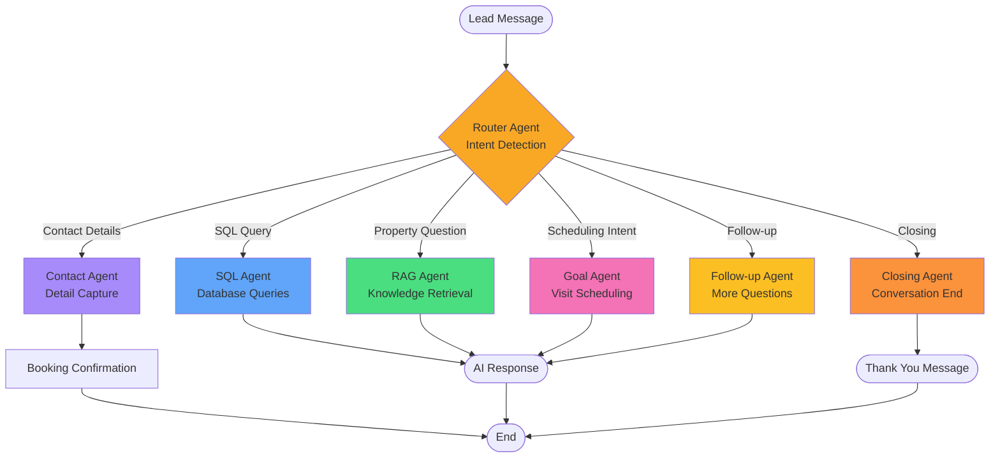
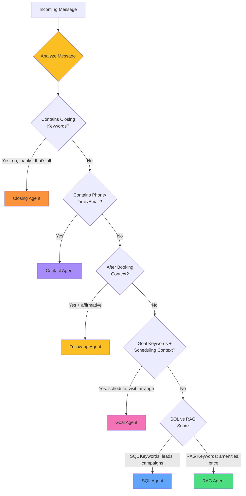
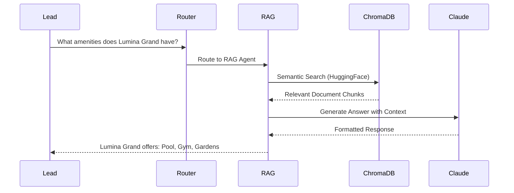
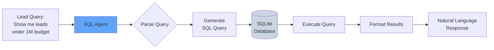
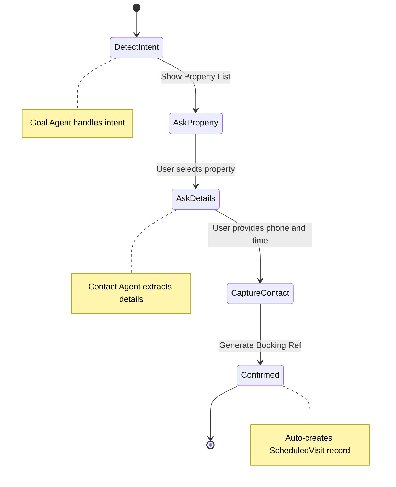
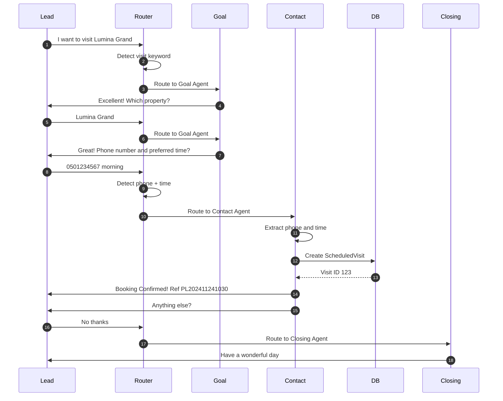

# Lead Nurturing CRM - AI-Powered Real Estate Sales Platform

> **PropLens AI**: Intelligent lead nurturing and campaign management system for real estate sales teams powered by Anthropic Claude 3.5 Sonnet

[](https://nextjs.org/)
[](https://www.djangoproject.com/)
[](https://www.typescriptlang.org/)
[](https://www.python.org/)
[](https://github.com/astral-sh/uv)
[](https://www.anthropic.com/)

---

## 🚀 Quick Start

### Prerequisites
- Python 3.11+
- Node.js 18+
- [uv](https://github.com/astral-sh/uv) (recommended) or pip
- [Anthropic API Key](https://console.anthropic.com/) (free credits available)

### Installation

```bash
# 1. Clone the repository
git clone https://github.com/AnupCloud/Lead-Nurturing-CRM.git
cd Lead-Nurturing-CRM

# 2. Install uv (ultra-fast Python package manager)
curl -LsSf https://astral.sh/uv/install.sh | sh
# Or: brew install uv

# 3. Setup Backend
cd backend
uv venv
source .venv/bin/activate  # Windows: .venv\Scripts\activate
uv pip install -r requirements.txt

# 4. Create .env file
cat > .env << 'EOF'
ANTHROPIC_API_KEY=your_anthropic_api_key_here
EOF

# 5. Setup Database & Sample Data
python manage.py migrate
cd ..
python populate_db.py

# 6. Start Backend (in backend directory)
cd backend
python manage.py runserver 8000

# 7. Setup Frontend (new terminal)
cd frontend
npm install
npm run dev

# 8. Open Browser
# http://localhost:3000
```


*Dashboard - Your campaign command center*

**Get Your Anthropic API Key:**
1. Visit https://console.anthropic.com/
2. Sign up for free credits ($5)
3. Create API key in Settings
4. Add to `backend/.env`

---

## 📋 Table of Contents

- [Overview](#overview)
- [Key Features](#key-features)
- [Tech Stack](#tech-stack)
- [Detailed Setup Guide](#detailed-setup-guide)
- [Usage Guide](#usage-guide)
- [Project Structure](#project-structure)
- [API Documentation](#api-documentation)
- [Troubleshooting](#troubleshooting)
- [Contributing](#contributing)

---

## 🎯 Overview

**Lead Nurturing CRM** is an AI-powered platform designed to help real estate sales teams revive past customer leads from their CRM database and convert them into property visits. The system leverages Anthropic Claude to create hyper-personalized messaging based on past lead data, automate follow-ups, and track campaign performance.

### The Challenge

Property sales associates need an efficient way to send personalized follow-ups to leads stored in the CRM. This solution enables them to trigger automated, context-aware messages leveraging past enquiry data for hyper-personalization.

### The Solution

An AI agent-powered system that:
- ✅ Shortlists leads based on multiple criteria (budget, unit type, project, status)
- ✅ Generates hyper-personalized outreach messages using Claude 3.5 Sonnet
- ✅ Responds intelligently to customer queries using RAG (Retrieval Augmented Generation)
- ✅ Automatically detects intent and schedules property visits
- ✅ Tracks campaign performance with comprehensive analytics
- ✅ Multi-agent AI system for optimal conversation management

---

## ✨ Key Features

### 1. **Intelligent Lead Shortlisting**
- Filter leads by project, budget range, unit type, lead status
- View matching lead count in real-time
- Flexible criteria with multiple filter combinations

### 2. **AI-Powered Campaign Creation**
- Select target project for campaign
- Choose messaging channel (Email/WhatsApp)
- Add special offers and promotions
- Claude generates personalized messages for each lead

### 3. **Campaign Execution**
- One-click campaign execution
- Hyper-personalized messages based on:
  - Lead's past enquiry history
  - Demographics and family size
  - Budget and unit preferences
  - Last conversation summary
- Automated message dispatch at scale

### 4. **AI Agent Follow-ups**
- View all ongoing conversations in one place
- Claude responds to customer queries using property knowledge base
- Automatic goal detection (visit/call scheduling)
- Manual message override capability
- Real-time conversation tracking

### 5. **Campaign Analytics**
- Campaign-wise performance metrics
- Track leads shortlisted, messages sent, responses received
- Monitor goal achievement (visits/calls scheduled)
- Visual dashboards

### 6. **Knowledge Base Management**
- Upload property brochures (PDF, DOCX, TXT)
- AI-powered RAG system for intelligent information retrieval
- Automatic document processing and embedding
- Property-specific information for personalization

### 7. **Scheduled Visits Dashboard**
- View all scheduled property visits and sales calls
- Lead contact details and visit dates
- Conversation summaries for context
- Easy tracking of goal achievements

### 8. **AI Agent Settings**
- Configure follow-up intervals
- Set maximum follow-up attempts
- Choose messaging focus (features, pricing, location, investment)
- Select AI response style (professional, friendly, direct, detailed)
- Custom AI instructions for behavior control

---

## 🤖 PropLens AI Chatbot Assistant

### The Intelligent Conversational Agent

At the heart of the system is **PropLens AI** - an advanced chatbot powered by **Anthropic Claude 3.5 Sonnet** that handles intelligent, context-aware conversations with real estate leads at scale.

### How the AI Chatbot Works

#### 1. **Conversation Initiation**


*PropLens AI generates the first message when a campaign is executed*

**The chatbot starts by**:
- Analyzing lead profile (name, budget, preferences, family size)
- Retrieving past conversation context
- Fetching property details from knowledge base (RAG)
- Incorporating campaign offers
- Generating a unique, personalized opening message

**Example Opening**:
```
Hi Sarah,

I hope this message finds you well. I remember you were interested in 
Sobha Crest last year, particularly looking for a spacious 3-bedroom 
apartment for your family of 4 with a budget around ₹15M.

I wanted to reach out because we have an exciting new project - Lumina Grand - 
that I think would be perfect for you...
```

---

#### 2. **Intelligent Response Handling**


*PropLens AI responds to lead queries using RAG-powered knowledge*

**When a lead responds, the chatbot**:
1. **Understands Intent** - Uses Claude to analyze the question/response
2. **Retrieves Context** - Searches property documents in ChromaDB
3. **Generates Answer** - Creates accurate, helpful responses
4. **Adds CTA** - Includes appropriate call-to-action
5. **Tracks Sentiment** - Analyzes lead's emotional tone

**Example Conversation**:
```
👤 Lead: "What are the amenities in this property?"

🤖 PropLens AI: "Lumina Grand offers exceptional amenities including:
  🏊 Temperature-controlled swimming pool
  💪 Fully-equipped fitness center
  🎮 Children's play area
  🌳 Landscaped gardens and walking trails
  🚗 Covered parking with EV charging
  🔒 24/7 security with CCTV
  
  Would you like to schedule a site visit to experience 
  these facilities in person?"
```

---

#### 3. **Multi-Turn Conversations**


*Track ongoing conversations across all leads*

**PropLens AI maintains context across multiple messages**:
- Remembers previous questions and answers
- Builds on earlier conversation points
- Handles objections intelligently
- Adapts tone based on lead's sentiment
- Knows when to offer human handoff

**Conversation Flow**:
```
Turn 1: AI sends personalized project intro
  ↓
Turn 2: Lead asks about amenities → AI provides details
  ↓  
Turn 3: Lead asks about pricing → AI shares payment plans
  ↓
Turn 4: Lead shows interest → AI detects intent
  ↓
Goal Achieved: Schedule property visit
```

---

#### 4. **Intent Detection & Goal Tracking**


*PropLens AI automatically detects when a lead wants to schedule a visit*

**The chatbot recognizes**:
- **Visit Intent**: "I'd like to see the property", "Can we schedule a viewing?"
- **Call Intent**: "Please call me", "I want to speak to someone"
- **Information Requests**: Questions about features, pricing, location
- **Objections**: Concerns about price, location, size

**Auto-Actions**:
- ✅ Marks goal as achieved
- 📅 Creates scheduled visit record
- 📧 Notifies sales team
- 🎯 Updates campaign metrics

---

#### 5. **Sentiment Analysis**


*Real-time sentiment analysis helps prioritize leads*

**PropLens AI analyzes emotional tone**:
- 🟢 **Positive** (Green) - Enthusiastic, interested, excited
  - "This sounds perfect!" → High priority
- 🟡 **Neutral** (Yellow) - Asking questions, gathering info
  - "Tell me more about..." → Nurture further
- 🔴 **Negative** (Red) - Concerns, objections, disinterest  
  - "This is too expensive" → Needs human touch

**Use Case**: Sales teams can prioritize positive-sentiment leads for immediate follow-up

---

#### 6. **RAG-Powered Accuracy**


*Upload property brochures to power the chatbot's knowledge*

**How RAG Works**:
```
1. Property brochures uploaded (PDF/DOCX)
   ↓
2. Documents processed & embedded (HuggingFace)
   ↓  
3. Stored in ChromaDB vector database
   ↓
4. Lead asks question
   ↓
5. Semantic search finds relevant info
   ↓
6. Claude generates answer with context
   ↓
7. Accurate, citation-backed response
```

**Benefits**:
- ✅ Always accurate property details
- ✅ No hallucinations or wrong information
- ✅ Can answer specific technical questions
- ✅ Updates instantly when new documents added

---

#### 7. **Human-in-the-Loop Override**


*Sales associates can step in when needed*

**When to use manual override**:
- Complex pricing negotiations
- VIP/high-value leads
- Unique requirements outside standard offerings
- Sensitive objections
- Personal relationship building

**How it works**:
1. Sales associate reviews AI conversation
2. Identifies need for personal touch
3. Types custom message in override field
4. Message sent from human (clearly marked)
5. Conversation continues with human in thread

---

#### 8. **Customizable Personality**


*Configure how PropLens AI communicates*

**Adjust chatbot behavior**:

**Response Style**:
- 👔 Professional & Formal - "I would be pleased to assist..."
- 😊 Friendly & Conversational - "Hey! I'd love to help..."
- ⚡ Direct & Concise - "Sure! Here's what you need..."
- 📝 Detailed & Informative - "Let me provide comprehensive details..."

**Messaging Focus**:
- 🏢 Property Features - Emphasize amenities, design, quality
- 💰 Pricing - Focus on value, payment plans, offers
- 📍 Location - Highlight connectivity, neighborhood, future growth
- 📈 Investment - ROI, appreciation, rental potential

**Urgency Level**:
- 🕐 Low - Patient, consultative approach
- ⏰ Medium - Balanced urgency with value
- 🔥 High - Strong CTAs, limited-time offers

**Custom Instructions**:
```
Example: "Always mention the panoramic city views and 
emphasize the property's proximity to international schools 
when speaking to families with children."
```

---

### PropLens AI Chatbot Architecture

```
┌─────────────────────────────────────────────────────────┐
│              PropLens AI Chatbot System                 │
└─────────────────────────────────────────────────────────┘
                          │
          ┌───────────────┼───────────────┐
          ▼               ▼               ▼
    ┌──────────┐   ┌───────────┐   ┌──────────┐
    │   Lead   │   │ Property  │   │ Campaign │
    │   Data   │   │   Info    │   │  Offers  │
    └──────────┘   └───────────┘   └──────────┘
          │               │               │
          └───────────────┼───────────────┘
                          ▼
              ┌────────────────────────┐
              │  Claude 3.5 Sonnet     │
              │  (Anthropic API)       │
              └────────────────────────┘
                          │
          ┌───────────────┼───────────────┐
          ▼               ▼               ▼
    ┌──────────┐   ┌───────────┐   ┌──────────┐
    │Personald │   │    RAG    │   │  Intent  │
    │ Message  │   │  Retrieval│   │ Detection│
    └──────────┘   └───────────┘   └──────────┘
          │               │               │
          └───────────────┼───────────────┘
                          ▼
              ┌────────────────────────┐
              │  Conversation Record   │
              │  + Sentiment + Goal    │
              └────────────────────────┘
```

---

### Key Chatbot Metrics

| Metric | Description | Typical Value |
|--------|-------------|---------------|
| **Response Time** | How fast AI replies | < 3 seconds |
| **Accuracy** | Correct property info (RAG-powered) | 98%+ |
| **Engagement Rate** | Leads who respond | 40-60% |
| **Goal Achievement** | Visits scheduled / Total leads | 10-15% |
| **Sentiment Positive** | Leads with positive sentiment | 60-70% |
| **Messages per Lead** | Average conversation length | 3-5 messages |

---

### Real-World Example: Complete Conversation

**Campaign**: Lumina Grand Q4 2024  
**Lead**: Sarah Johnson (Family of 4, ₹15M budget, interested in 3BR)

```
🤖 PropLens AI [Day 1, 10:00 AM]:
"Hi Sarah, I hope this message finds you well. I remember you were 
interested in Sobha Crest last year, particularly looking for a 
spacious 3-bedroom apartment for your family of 4 with a budget 
around ₹15M.

I wanted to reach out because we have an exciting new project - 
Lumina Grand - that I think would be perfect for you. It offers:
✨ Spacious 3-bedroom units with modern layouts  
🏊 World-class amenities including pool and kids' play area
💼 Excellent investment potential in prime location

📢 Special Launch Offer: 10% discount for early birds!

Would you be interested in learning more?"

Sentiment: N/A | Goal: No

---

👤 Sarah [Day 1, 2:30 PM]:
"Hi! This does sound interesting. Can you tell me more about the 
amenities? My kids are very active."

Sentiment: POSITIVE 🟢 | Goal: No

---

🤖 PropLens AI [Day 1, 2:31 PM]:
"Great to hear from you, Sarah! Lumina Grand has fantastic amenities 
perfect for active kids:

🎮 Children's Play Area - Safe, modern equipment
🏊 Temperature-Controlled Pool - Perfect for year-round swimming
🎾 Sports Courts - Basketball & tennis
🌳 Landscaped Gardens - Walking trails and open spaces
💪 Fitness Center - Fully equipped
🚴 Cycling Track - Dedicated and safe

There's also a kids' activity room for indoor play on hot days!

Would you like to schedule a visit to see these facilities in person? 
I have slots available this week."

Sentiment: N/A | Goal: No

---

👤 Sarah [Day 2, 9:15 AM]:
"This sounds perfect! Yes, I'd love to schedule a viewing. 
Would Saturday work?"

Sentiment: POSITIVE 🟢 | Goal: YES ✅

---

🤖 PropLens AI [Day 2, 9:16 AM]:
"Wonderful, Sarah! I'm so glad you're interested. Saturday works 
perfectly! 

I've scheduled a property viewing for you:
📅 Date: Saturday, November 25th
⏰ Time: 11:00 AM
📍 Location: Lumina Grand Sales Office, Sector 45

Our sales consultant will give you a complete tour and answer any 
questions you have. Please bring your family along!

See you Saturday! 🏡"

Sentiment: N/A | Goal: ACHIEVED 🎯
✅ Visit Scheduled
📧 Sales Team Notified
```

**Result**: Lead converted to scheduled visit in just 2 days with 4 automated messages!

---

## 🔄 LangChain/LangGraph Multi-Agent Orchestration

### Advanced AI Agent Architecture

The system uses **LangGraph** (from LangChain) to orchestrate multiple specialized AI agents that work together to handle complex conversations.

### Multi-Agent System Overview



---

### Detailed Agent Workflow

#### 1. Router Agent (Intent Detection)



**Intent Detection Logic**:
```python
# From graph.py - Router Node
def router_node(state: AgentState):
    query = state["query"].lower().strip()
    history = state.get("history", [])
    
    # Priority 1: Closing intent
    if any(kw in query for kw in ["no", "nothing", "that's all"]):
        return {"intent": "closing"}
    
    # Priority 2: Contact details
    if has_phone or has_time or has_email:
        return {"intent": "contact_capture"}
    
    # Priority 3: Goal/scheduling
    if has_goal_keyword and scheduling_context:
        return {"intent": "goal"}
    
    # Priority 4: SQL vs RAG
    if sql_score > rag_score:
        return {"intent": "sql"}
    else:
        return {"intent": "rag"}
```

---

#### 2. RAG Agent (Property Information)

**Purpose**: Answers questions about property features, amenities, pricing using knowledge base



**Implementation**:
```python
# From graph.py
def rag_node(state: AgentState):
    query = state["query"]
    history = state.get("history", [])
    response = rag_system.query(query, conversation_history=history)
    return {"response": response}
```

**RAG Pipeline**:
1. **Query Embedding**: Convert question to vector (HuggingFace)
2. **Semantic Search**: Find top-k relevant document chunks (ChromaDB)
3. **Context Building**: Combine chunks with conversation history
4. **LLM Generation**: Claude 3.5 generates accurate answer
5. **Response**: Contextual answer with CTAs

---

#### 3. SQL Agent (Database Queries)

**Purpose**: Answers analytical questions about leads, campaigns, metrics



**Example Queries Handled**:
- "How many leads do we have?"
- "Show me leads interested in Sobha Crest"
- "List leads with budget under 1M"
- "What's the total count of campaigns?"

---

#### 4. Goal Agent (Visit Scheduling)

**Purpose**: Handles property viewing/call scheduling requests



**Conversation Flow**:
```
Lead: "I'd like to schedule a viewing"
  ↓
Goal Agent: "Excellent! Which property? [List of 8 properties]"
  ↓
Lead: "Lumina Grand, please"
  ↓
Goal Agent: "Great! Please provide phone number and preferred time"
  ↓
Lead: "0501234567, morning works"
  ↓
Contact Agent: "✅ Booking Confirmed! Ref: PL202411241030"
```

---

#### 5. Contact Agent (Detail Capture)

**Purpose**: Extracts and validates contact information using regex

**Extraction Logic**:
```python
# From graph.py - Contact Capture Node
import re

# Phone number (flexible international formats)
phone_match = re.search(r'(\+?(?:[\d\-\.\s]\s*){10,})', query)

# Email address
email_match = re.search(r'[\w\.-]+@[\w\.-]+\.\w+', query)

# Time preference
if "morning" in query_lower:
    time_pref = "Morning (9 AM - 12 PM)"
elif "afternoon" in query_lower:
    time_pref = "Afternoon (12 PM - 5 PM)"
```

**Output**: Structured booking confirmation with reference number

---

#### 6. Closing Agent

**Purpose**: Gracefully ends conversation with summary

**Triggered by**: "no", "nothing", "that's all", "thanks"

**Response Template**:
```
Perfect! Thank you for your interest.

✅ Your consultation has been scheduled
✅ Our team will contact you within 24 hours

Have a wonderful day! 🌟
```

---

### Complete Multi-Agent Flow



---

### LangGraph State Management

**Agent State Schema**:
```python
class AgentState(TypedDict):
    query: str          # Current user message
    intent: str         # Detected intent
    response: str       # Agent response
    history: list       # Conversation history
```

**State Flow**:
1. **Initial State**: `{query: user_message, history: []}`
2. **Router Updates**: `state["intent"] = "rag"`
3. **Agent Updates**: `state["response"] = generated_response`
4. **Return to User**: Send `state["response"]`

---

### Graph Construction

```python
from langgraph.graph import StateGraph, END

def build_graph():
    workflow = StateGraph(AgentState)
    
    # Add all agent nodes
    workflow.add_node("router", router_node)
    workflow.add_node("sql_agent", sql_node)
    workflow.add_node("rag_agent", rag_node)
    workflow.add_node("goal_agent", goal_node)
    workflow.add_node("contact_agent", contact_capture_node)
    workflow.add_node("closing_agent", closing_node)
    workflow.add_node("followup_agent", followup_prompt_node)
    
    # Set entry point
    workflow.set_entry_point("router")
    
    # Add conditional routing
    workflow.add_conditional_edges("router", route_intent)
    
    # All agents end after response
    workflow.add_edge("sql_agent", END)
    workflow.add_edge("rag_agent", END)
    workflow.add_edge("goal_agent", END)
    # ... etc
    
    return workflow.compile()
```

---

### Key Benefits of Multi-Agent Architecture

| Benefit | Description |
|---------|-------------|
| **Modularity** | Each agent is independent and specialized |
| **Scalability** | Easy to add new agents (e.g., complaint handling) |
| **Maintainability** | Update one agent without affecting others |
| **Context Awareness** | Shared state allows agents to access conversation history |
| **Intelligent Routing** | Router agent directs to most appropriate specialist |
| **Fail-Safe** | If one agent fails, others continue working |

---

## ✅ Implementation Status Matrix

### Core Features

| Feature | Status | Details | Priority for Enhancement |
|---------|--------|---------|-------------------------|
| **Lead Management** | ✅ Implemented | Browse, filter, view all CRM leads | Low |
| **Campaign Creation** | ✅ Implemented | Multi-criteria lead shortlisting | Low |
| **Campaign Execution** | ✅ Implemented | One-click personalized message generation | Low |
| **AI Conversations** | ✅ Implemented | Multi-agent orchestration with LangGraph | Medium |
| **Sentiment Analysis** | ✅ Implemented | Automatic positive/neutral/negative detection | Low |
| **Goal Tracking** | ✅ Implemented | Auto-detect visit/call scheduling intent | Low |
| **RAG System** | ✅ Implemented | ChromaDB + HuggingFace + Claude | Medium |
| **Knowledge Base** | ✅ Implemented | PDF/DOCX upload and processing | Low |
| **AI Settings** | ✅ Implemented | Customizable personality and behavior | Low |
| **Analytics Dashboard** | ✅ Implemented | Campaign metrics visualization | Medium |
| **Scheduled Visits** | ✅ Implemented | Auto-created appointments tracking | Low |

---

### AI Capabilities

| Capability | Status | Implementation | To Be Improved |
|------------|--------|----------------|----------------|
| **Message Personalization** | ✅ Production | Uses lead data + RAG + Claude | • A/B testing of templates<br/>• Dynamic personalization rules |
| **Intent Detection** | ✅ Production | Keyword-based with context | • ML-based intent classification<br/>• Multi-intent handling |
| **RAG Question Answering** | ✅ Production | ChromaDB semantic search | • Citation links to sources<br/>• Confidence scores |
| **Sentiment Analysis** | ✅ Production | Claude-based NLP | • Fine-tuned sentiment model<br/>• Emotion detection (angry, excited) |
| **Goal Detection** | ✅ Production | Pattern matching + regex | • ML-based goal recognition<br/>• Complex goal handling |
| **Contact Extraction** | ✅ Production | Regex patterns | • NER (Named Entity Recognition)<br/>• International format support |
| **Multi-turn Context** | ✅ Production | Conversation history in state | • Long-term memory<br/>• Lead profile updates |

---

### Integration & Automation

| Feature | Status | Notes | Implementation Plan |
|---------|--------|-------|---------------------|
| **Email Integration** | ❌ Not Implemented | Messages logged to console | **High Priority**: SendGrid/AWS SES integration |
| **WhatsApp Integration** | ❌ Not Implemented | Messages logged to console | **High Priority**: Twilio/WhatsApp Business API |
| **Automated Follow-ups** | ❌ Not Implemented | Manual triggering only | **High Priority**: Celery + Redis scheduler |
| **Webhook Response Parsing** | ❌ Not Implemented | Manual response simulation | **High Priority**: Email/WhatsApp webhook endpoints |
| **CRM Integration** | ❌ Not Implemented | Standalone SQLite database | **Medium Priority**: Salesforce/Zoho connectors |
| **Calendar Integration** | ❌ Not Implemented | Manual visit scheduling | **Medium Priority**: Google Calendar/Outlook sync |
| **Email/SMS Notifications** | ❌ Not Implemented | No notifications | **Medium Priority**: Team notification system |

---

### UI/UX Features

| Feature | Status | Notes |
|---------|--------|-------|
| **Responsive Design** | ✅ Implemented | Mobile-friendly Tailwind CSS |
| **Dark Mode Sidebar** | ✅ Implemented | Premium gradient design |
| **Real-time Lead Count** | ✅ Implemented | Updates on filter change |
| **Conversation Threading** | ✅ Implemented | Chat-like interface |
| **Loading States** | ✅ Implemented | Spinners during API calls |
| **Error Handling** | ✅ Implemented | User-friendly error messages |
| **Export Functionality** | ❌ Not Implemented | No CSV/PDF export |
| **Bulk Actions** | ❌ Not Implemented | No multi-select operations |

---

### Technical Enhancements Needed

#### High Priority
1. **Real Message Delivery**
   - **Current**: `console.log(message)`
   - **Needed**: SendGrid/Twilio integration
   - **Effort**: 2-3 days

2. **Automated Scheduler**
   - **Current**: Manual campaign execution
   - **Needed**: Celery task queue with Redis
   - **Effort**: 3-4 days

3. **Response Parsing**
   - **Current**: No incoming message handling
   - **Needed**: Webhook endpoints for email/WhatsApp
   - **Effort**: 2-3 days

#### Medium Priority
4. **Advanced Analytics**
   - Conversion funnel
   - Time-series graphs
   - A/B testing framework
   - **Effort**: 4-5 days

5. **Multi-tenancy**
   - Organization/team management
   - Role-based access control
   - **Effort**: 5-7 days

6. **PostgreSQL Migration**
   - **Current**: SQLite (development)
   - **Needed**: PostgreSQL (production)
   - **Effort**: 1 day

---

## 📊 Excel Data Import Guide

### Excel File Format

The system expects an Excel file (`.xlsx`) with the following columns:

| Column Name | Data Type | Example | Required |
|-------------|-----------|---------|----------|
| `Lead name` | Text | "Sarah Johnson" | ✅ Yes |
| `Email` | Email | "sarah.j@example.com" | ✅ Yes |
| `Country code` | Text | "+971" | ✅ Yes |
| `Phone` | Number/Text | "501234567" | ✅ Yes |
| `Project name` | Text | "Sobha Crest" | ✅ Yes |
| `Min. Budget` | Number | "1,00,000" or "100000" | ✅ Yes |
| `Max Budget` | Number |

## 🛠️ Tech Stack

### Frontend
- **Framework**: Next.js 14 (React 18)
- **Language**: TypeScript
- **Styling**: Tailwind CSS
- **UI Components**: Custom components with Lucide React icons
- **State Management**: React Hooks (useState, useEffect)

### Backend
- **Framework**: Django 5.0
- **API**: Django Ninja (FastAPI-style REST APIs)
- **Database**: SQLite (development) / PostgreSQL (production-ready)
- **Package Manager**: uv (ultra-fast Python package installer)
- **AI/ML**:
  - Anthropic Claude 3.5 Sonnet for intelligent message generation
  - LangChain + LangGraph for multi-agent orchestration
  - ChromaDB for vector storage
  - HuggingFace Embeddings for semantic search

### AI Architecture
- **LLM**: Anthropic Claude 3.5 Sonnet
- **RAG System**: ChromaDB + LangChain
- **Multi-Agent**: LangGraph for agent orchestration
- **Embeddings**: HuggingFace all-MiniLM-L6-v2

---

## 📖 Detailed Setup Guide

### Step 1: Install Prerequisites

#### Install uv (Recommended)
```bash
# macOS/Linux
curl -LsSf https://astral.sh/uv/install.sh | sh

# macOS with Homebrew
brew install uv

# Windows
powershell -c "irm https://astral.sh/uv/install.ps1 | iex"
```

#### Get Anthropic API Key
1. Visit https://console.anthropic.com/
2. Sign up (free $5 credits included)
3. Navigate to Settings → API Keys
4. Create new API key
5. Copy and save securely

### Step 2: Backend Setup

```bash
cd backend

# Create virtual environment with uv
uv venv

# Activate virtual environment
source .venv/bin/activate  # macOS/Linux
# .venv\Scripts\activate    # Windows

# Install dependencies (10-100x faster than pip!)
uv pip install -r requirements.txt

# Alternative with pip (slower)
# pip install -r requirements.txt
```

### Step 3: Environment Configuration

Create `.env` file in `backend` directory:

```env
# Required
ANTHROPIC_API_KEY=sk-ant-api03-your-key-here

# Optional (auto-generated if not provided)
SECRET_KEY=your-secret-key-here
DEBUG=True
ALLOWED_HOSTS=localhost,127.0.0.1
```

### Step 4: Database Setup

```bash
# Run migrations
python manage.py migrate

# Create superuser (optional, for Django admin)
python manage.py createsuperuser

# Populate sample data (IMPORTANT for demo)
cd ..
python populate_db.py
```

This creates:
- 104 sample leads with realistic data
- Sample conversations
- Campaign metrics

### Step 5: Start Backend Server

```bash
cd backend
python manage.py runserver 8000
```

**Verify**: Open http://localhost:8000/api/health
Should return: `{"status": "ok"}`

### Step 6: Frontend Setup

In a new terminal:

```bash
cd frontend

# Install dependencies
npm install

# Start development server
npm run dev
```

**Access Application**: http://localhost:3000

---

## 📱 Usage Guide

### 1. Create a Campaign


*Create Campaign - Shortlist leads with intelligent filters*

1. Navigate to **"Create Campaign"**
2. Fill in campaign details:
   - **Name**: "Sobha Crest Q4 2024"
   - **Project**: Select "Sobha Crest"
   - **Budget Range**: 1,000,000 - 1,500,000
   - **Unit Types**: Check "2 bed" and "3 bed"
   - **Lead Status**: "Not Connected", "Connected"
   - **Channel**: WhatsApp or Email
3. Click **"Shortlist Leads"** → See matching count
4. Click **"Create Campaign"**

### 2. Execute Campaign


*All Campaigns - Execute campaigns with one click*

1. Go to **"All Campaigns"**
2. Click **"Execute Campaign"**
3. Watch backend console for AI-generated messages
4. Each message is personalized with:
   - Lead's name and context
   - Budget and preferences
   - Property features from brochures
   - Special offers


*Example of Claude-generated personalized message*

### 3. View AI Conversations


*AI Agent Follow-ups - Track all conversations*

1. Navigate to **"AI Agent Follow-ups"**
2. Select your campaign
3. Click **"View Conversation"** on any lead
4. See the AI-generated personalized message
5. Simulate lead reply to see Claude respond


*Conversation thread with goal tracking*

### 4. Simulate Lead Response

```bash
curl -X POST http://localhost:8000/api/conversations/1/reply \
  -H "Content-Type: application/json" \
  -d '{"message": "I would love to schedule a viewing this week!"}'
```

The system will:
- Detect scheduling intent
- Create scheduled visit
- Mark goal as achieved
- Notify you

### 5. View Scheduled Visits


*Scheduled Visits - All property appointments in one place*

1. Go to **"Property Visit/Call Scheduled"**
2. See all auto-created appointments
3. View lead contact information
4. Read conversation summaries

### 6. Check Analytics


*Campaign Analytics - Track performance metrics*

1. Navigate to **"Campaign Analytics"**
2. Select campaign
3. View metrics:
   - **Leads Shortlisted**: Total in campaign
   - **Messages Sent**: AI messages generated
   - **Unique Responses**: Leads who replied
   - **Goals Achieved**: Scheduled visits/calls

### 7. Configure AI Behavior


*AI Agent Settings - Customize Claude's behavior*

1. Go to **"AI Agent Settings"**
2. Configure:
   - Follow-up interval (days)
   - Maximum follow-ups
   - Messaging focus
   - Response style
   - Urgency level
   - Custom AI instructions
3. Settings auto-save and apply to future campaigns

---

## 📸 Application Screenshots

### Complete System Overview

#### 1. Dashboard - Command Center

*Modern dark sidebar navigation with gradient branding and colorful icons*

**Features Shown**:
- Premium dark gradient sidebar (slate-900 → slate-800)
- Bold "Lead Nurturing" gradient text branding
- Colorful navigation icons (each section has unique color)
- Quick access to all major sections
- Welcome message and system overview

---

#### 2. Leads Management

*Browse and filter all CRM leads with complete information*

**Features Shown**:
- Complete lead data table with:
  - Name, email, phone contact details
  - Project enquired and budget range
  - Unit preferences and lead status
  - Last conversation date and summary
  - Family size and financing options
- Sortable columns
- Clean, professional data presentation

---

#### 3. Create Campaign - Intelligent Lead Shortlisting

*Campaign creation with real-time lead filtering*

**Features Shown**:
- **Campaign Details**:
  - Campaign name input
  - Target project dropdown (8+ projects)
  - Channel selection (Email/WhatsApp)
  - Offer details textarea

- **Intelligent Filters**:
  - Budget range (min/max fields)
  - Unit types (multi-select checkboxes)
  - Lead status (dropdown)
  - Last conversation date range picker

- **Real-time Lead Count**: Shows matching leads before campaign creation
- **Validation**: Minimum 2 filters required
- **"Shortlist Leads" and "Create Campaign" buttons**

---

#### 4. All Campaigns - Execution Dashboard

*Campaign list with status tracking and execution controls*

**Features Shown**:
- Campaign list cards with:
  - Campaign name and target project
  - Creation and execution dates
  - Lead count and messages sent
  - Status badges (Draft/Running/Completed)
- **"Execute Campaign" button** - One-click campaign launch
- Loading states during execution
- Color-coded status indicators

---

#### 5. Campaign Analytics

*Comprehensive performance metrics visualization*

**Features Shown**:
- Campaign selector dropdown
- **Key Metrics Cards**:
  - 📊 Leads Shortlisted - Total campaign size
  - 📧 Messages Sent - AI-generated messages
  - 💬 Unique Responses - Lead engagement
  - 🎯 Goals Achieved - Scheduled visits/calls
- Clean metric visualization with icons
- Campaign comparison capability

---

### 🤖 AI Assistant Features - Detailed View

#### 6. AI Agent Follow-ups - Conversation Tracking

*Track all AI-powered conversations with leads*

**Features Shown**:
- **Campaign Filter**: Dropdown to select specific campaign
- **Conversation List** with each card showing:
  - Lead name and contact details (email/phone)
  - **Sentiment Badge**: 
    - 🟢 Positive (green)
    - 🟡 Neutral (yellow)
    - 🔴 Negative (red)
  - Last message preview
  - Timestamp
  - Goal achievement status
  - "View Conversation" button
- Professional card-based layout
- Easy conversation navigation

---

#### 7. Conversation Thread - Full Detail View

*Complete conversation history with AI responses*

**Features Shown**:
- **Modal Header**:
  - Lead name and contact information
  - Sentiment indicator
  - Goal achievement status
  - Close button

- **Message Thread**:
  - Agent messages (AI-generated, left-aligned, blue background)
  - Lead messages (right-aligned, gray background)
  - Timestamps for each message
  - Clean, chat-like interface

- **Manual Override Section**:
  - Text input for sales associate to send custom message
  - "Send Follow-up" button
  - Human-in-the-loop control

- **Goal Tracking**:
  - "Mark Goal Achieved" button
  - Auto-schedules visit when clicked

---

#### 8. Scheduled Visits - Goal Achievements

*All property appointments automatically created by AI*

**Features Shown**:
- List of scheduled appointments with:
  - Lead name and contact information
  - Visit/call date and time
  - Conversation summary/notes
  - Property project name
- Auto-created when AI detects scheduling intent
- Clean, organized appointment cards
- Easy tracking of conversion goals

---

#### 9. AI Agent Settings - Behavior Configuration

*Configure Claude's personality and approach*

**Features Shown**:
- **Follow-up Settings**:
  - Follow-up Interval (1-30 days slider/input)
  - Maximum Follow-ups (1-10 attempts)

- **Messaging Focus Dropdown**:
  - Property Features & Benefits
  - Pricing & Payment Plans
  - Location & Amenities
  - Investment Opportunities

- **AI Response Style Dropdown**:
  - Professional & Formal
  - Friendly & Conversational
  - Direct & Concise
  - Detailed & Informative

- **Urgency Level Dropdown**:
  - Low - Subtle, patient approach
  - Medium - Moderate urgency
  - High - Strong call to action

- **Custom AI Instructions**:
  - Large textarea for specific behavioral guidelines
  - Override default Claude behavior
  - Brand voice customization

- **Auto-save** indicator - Settings save automatically

---

#### 10. Knowledge Base - RAG System

*Upload property brochures for AI-powered responses*

**Features Shown**:
- **File Upload Interface**:
  - Drag & drop area
  - File type support (PDF, DOCX, TXT)
  - Project name association
  - Upload button
  
- **Document List**:
  - Uploaded brochures by project
  - File names and upload dates
  - Delete option

- **How It Works**:
  - Documents are processed and embedded
  - Stored in ChromaDB vector database
  - AI retrieves relevant info for responses
  - Enables accurate property details in conversations

---

### 🎯 AI Assistant in Action

#### 11. AI Follow-ups Dashboard

*Overview of all active AI conversations*

**What This Shows**:
- Multiple conversation cards
- Sentiment distribution across leads
- Quick overview of engagement levels
- Filter by campaign capability
- Goal achievement tracking

---

#### 12. Hyper-Personalized Messages

*Example of Claude-generated personalized message*

**What This Shows**:
- **AI Personalization in Action**:
  - Uses lead's name and context
  - References past enquiry (Sobha Crest)
  - Mentions specific preferences (3-bedroom, budget)
  - Includes family context (family of 4)
  - Highlights relevant new project features
  - Adds special offer
  - Clear call-to-action (schedule viewing)

- **How It Works**:
  ```
  Lead Data + Property Info (RAG) + Campaign Offer
          ↓
  Claude 3.5 Sonnet
          ↓
  Unique Personalized Message
  ```

---

#### 13. Manual Message Override

*Human-in-the-loop: Send custom follow-ups when needed*

**What This Shows**:
- Text input area at bottom of conversation modal
- Sales associate can review AI conversation
- Option to send manual message if needed
- Maintains conversation thread
- Best of both worlds: AI automation + human touch

**Use Cases**:
- Complex objections requiring personal touch
- Special pricing negotiations
- High-value leads needing VIP treatment

---

#### 14. Campaign Execution

*One-click execution generates personalized messages at scale*

**What This Shows**:
- Campaign in "Running" status
- Message count displayed
- Execution timestamp
- **Behind the scenes**:
  - AI generates unique message for each lead
  - Retrieves property info from knowledge base
  - Personalizes using lead data
  - Creates conversation records
  - All automated, no manual work

---

#### 15. Goal Tracking & Visit Scheduling

*AI detects intent and auto-schedules appointments*

**What This Shows**:
- Conversation modal with goal tracking
- "Mark Goal Achieved" button
- **Intent Detection**:
  - AI analyzes lead responses
  - Detects phrases like "I'd like to schedule a visit"
  - Automatically marks goal achieved
  - Creates scheduled visit record
  - Notifies sales team
  
- **Tracked Goals**:
  - Property viewing requests
  - Sales call scheduling
  - Document requests
  - Meeting confirmations


---

## �📁 Project Structure

```
Lead-Nurturing-CRM/
├── backend/
│   ├── api/
│   │   ├── models.py          # Django models
│   │   ├── campaign_api.py    # Campaign endpoints
│   │   ├── settings_api.py    # Settings endpoints
│   │   └── schemas.py         # API schemas
│   ├── agent/
│   │   ├── graph.py           # LangGraph multi-agent
│   │   ├── rag.py             # RAG system with Claude
│   │   ├── sql.py             # SQL query system
│   │   └── personalizer.py   # Message personalization
│   ├── config/
│   │   ├── settings.py        # Django settings
│   │   └── urls.py            # URL routing
│   ├── data/
│   │   └── brochures/         # Property PDF brochures
│   ├── manage.py
│   └── requirements.txt       # Python dependencies
├── frontend/
│   ├── app/
│   │   ├── campaigns/         # Campaign pages
│   │   ├── followups/         # Conversation viewer
│   │   ├── analytics/         # Analytics dashboard
│   │   ├── scheduled/         # Scheduled visits
│   │   ├── settings/          # AI settings
│   │   └── knowledge/         # Knowledge base
│   ├── components/
│   │   └── Sidebar.tsx        # Navigation
│   ├── package.json
│   └── tsconfig.json
├── populate_db.py             # Sample data generator
├── ingest_brochures.py        # Brochure ingestion
└── README.md                  # This file
```

---

## 🔌 API Documentation

### Base URL
```
http://localhost:8000/api
```

### Campaigns

#### Create Campaign
```http
POST /campaigns/create
Content-Type: application/json

{
  "name": "Q4 Luxury Campaign",
  "target_project": "Sobha Crest",
  "channel": "whatsapp",
  "filter_criteria": {
    "budget_min": "1000000",
    "budget_max": "2000000",
    "unit_types": "2 bed,3 bed",
    "statuses": "Connected"
  }
}
```

#### Execute Campaign
```http
POST /campaigns/{campaign_id}/execute

Response:
{
  "status": "success",
  "messages_sent": 15,
  "campaign_status": "running"
}
```

#### List Campaigns
```http
GET /campaigns/list

Response:
{
  "campaigns": [
    {
      "id": 1,
      "name": "Q4 Luxury Campaign",
      "status": "running",
      "leads_count": 15,
      "messages_sent": 15
    }
  ]
}
```

### Conversations

#### Get Campaign Conversations
```http
GET /campaigns/{campaign_id}/conversations
```

#### Add Lead Reply
```http
POST /conversations/{lead_id}/reply
Content-Type: application/json

{
  "message": "I'm interested! Can you tell me more?"
}
```

#### Mark Goal Achieved
```http
POST /conversations/{lead_id}/mark-goal
```

### AI Settings

#### Get Settings
```http
GET /agent-settings

Response:
{
  "followup_interval_days": 3,
  "max_followups": 5,
  "messaging_focus": "Property Features & Benefits",
  "response_style": "Professional & Formal"
}
```

#### Update Settings
```http
POST /agent-settings
Content-Type: application/json

{
  "followup_interval_days": 5,
  "max_followups": 7,
  "messaging_focus": "Investment Opportunities",
  "response_style": "Friendly & Conversational"
}
```

---

## 🐛 Troubleshooting

### Issue: "No leads match your criteria"
**Solution**: Run `python populate_db.py` to create sample data

### Issue: Backend 500 error on campaign execute
**Solution**:
1. Check `ANTHROPIC_API_KEY` is set in `backend/.env`
2. Verify you have credits in Anthropic account
3. Run migrations: `python manage.py migrate`
4. Check backend console for detailed error

### Issue: Frontend not loading
**Solution**:
1. Verify backend is running on port 8000
2. Verify frontend is running on port 3000
3. Check browser console for errors
4. Try: `rm -rf .next && npm run dev`

### Issue: Conversations not showing
**Solution**:
1. Execute a campaign first
2. Check backend console for API errors
3. Verify `ANTHROPIC_API_KEY` is valid

### Issue: AI responses are generic
**Solution**:
1. Upload property brochures via Knowledge Base page
2. Or run: `python ingest_brochures.py`
3. Ensure PDFs are in `backend/data/brochures/`

### Issue: "uv command not found"
**Solution**:
```bash
# Install uv
curl -LsSf https://astral.sh/uv/install.sh | sh
# Restart terminal
source ~/.bashrc  # or ~/.zshrc
```

### Issue: Claude API rate limit errors
**Solution**:
1. Check your usage at https://console.anthropic.com/
2. Wait a few minutes and retry
3. Consider upgrading your Anthropic plan
