# Lead Nurturing CRM - AI-Powered Real Estate Sales Platform

> **PropLens AI**: Intelligent lead nurturing and campaign management system for real estate sales teams

[](https://nextjs.org/)
[](https://www.djangoproject.com/)
[](https://www.typescriptlang.org/)
[](https://www.python.org/)
[](https://github.com/astral-sh/uv)

---

## 📋 Table of Contents

- [Overview](#overview)
- [Key Features](#key-features)
- [Tech Stack](#tech-stack)
- [Installation \& Setup](#installation--setup)
- [Application Screenshots](#application-screenshots)
- [Implemented Features](#implemented-features)
- [Future Improvements](#future-improvements)
- [Project Structure](#project-structure)
- [API Documentation](#api-documentation)
- [Contributing](#contributing)

---

## 🎯 Overview

**Lead Nurturing CRM** is an AI-powered platform designed to help real estate sales teams revive past customer leads from their CRM database and convert them into property visits. The system leverages AI agents to create hyper-personalized messaging based on past lead data, automate follow-ups, and track campaign performance.

### The Challenge

Property sales associates need an efficient way to send personalized follow-ups to leads stored in the CRM. This solution enables them to trigger automated, context-aware emails or WhatsappWhatsApp messages, leveraging past enquiry data for hyper-personalization.

### The Solution

An AI agent-powered system that:
- ✅ Shortlists leads based on multiple criteria (budget, unit type, project, status)
- ✅ Generates hyper-personalized outreach messages using AI
- ✅ Automates message dispatch without manual intervention
- ✅ Responds intelligently to customer queries using RAG (Retrieval Augmented Generation)
- ✅ Schedules property visits and sales calls
- ✅ Tracks campaign performance with comprehensive analytics

---

## ✨ Key Features

### 1. **Intelligent Lead Shortlisting**
- Filter leads by project, budget range, unit type, lead status
- View matching lead count in real-time
- Flexible criteria with at least 2 filter requirement

### 2. **AI-Powered Campaign Creation**
- Select target project for campaign
- Choose messaging channel (Email/WhatsApp)
- Add special offers and promotions
- AI generates personalized messages for each lead

### 3. **Campaign Execution**
- One-click campaign execution
- Hyper-personalized messages based on:
  - Lead's past enquiry history
  - Demographics and family size
  - Budget and unit preferences
  - Last conversation summary
- Automated message dispatch at scale

### 4. **AI Agent Follow-ups**
- View all ongoing conversations in one place
- AI responds to customer queries using property knowledge base
- Sentiment analysis for lead prioritization
- Manual message override capability
- Goal tracking (visit/call scheduled)

### 5. **Campaign Analytics**
- Campaign-wise performance metrics
- Track leads shortlisted, messages sent, responses received
- Monitor goal achievement (visits/calls scheduled)
- Visual dashboards with charts and trends

### 6. **Knowledge Base Management**
- Upload property brochures and documents (PDF, DOCX, TXT)
- AI-powered RAG system for intelligent information retrieval
- Automatic document processing and embedding
- Property-specific information for personalization

### 7. **Scheduled Visits Dashboard**
- View all scheduled property visits and sales calls
- Lead contact details and visit dates
- Conversation summaries for context
- Easy tracking of goal achievements

### 8. **AI Agent Settings**
- Configure follow-up intervals
- Set maximum follow-up attempts
- Choose messaging focus (features, pricing, location, investment)
- Select AI response style (professional, friendly, direct, detailed)
- Set urgency level (low, medium, high)
- Custom AI instructions for behavior control

---

## 🛠️ Tech Stack

### Frontend
- **Framework**: Next.js 14 (React 18)
- **Language**: TypeScript
- **Styling**: Tailwind CSS
- **UI Components**: Custom components with Lucide React icons
- **State Management**: React Hooks (useState, useEffect)

### Backend
- **Framework**: Django 5.0
- **API**: Django Ninja (FastAPI-style REST APIs)
- **Database**: SQLite (development) / PostgreSQL (production-ready)
- **Package Manager**: uv (ultra-fast Python package installer)
- **AI/ML**:
  - Google Gemini AI / Anthropic Claude for message generation
  - LangChain + LangGraph for multi-agent orchestration
  - ChromaDB for vector storage
  - HuggingFace Embeddings for RAG

### Other Tools
- **Version Control**: Git
- **Package Managers**: npm (frontend), uv/pip (backend)
- **Development**: Hot reload, TypeScript checking

---

## 🚀 Installation & Setup

### Prerequisites

- **Node.js**: v18+ ([Download](https://nodejs.org/))
- **Python**: v3.11+ ([Download](https://www.python.org/downloads/))
- **uv**: Latest version ([Install](https://github.com/astral-sh/uv))
  ```bash
  # Install uv (ultra-fast Python package manager)
  curl -LsSf https://astral.sh/uv/install.sh | sh
  # Or on macOS:
  brew install uv
  ```
- **Git**: Latest version
- **AI API Key**: Google Gemini API key ([Get one](https://makersuite.google.com/app/apikey))

### Backend Setup

1. **Clone the repository**
```bash
git clone https://github.com/AnupCloud/Lead-Nurturing-CRM.git
cd Lead-Nurturing-CRM/backend
```

2. **Create virtual environment with uv**
```bash
# uv automatically creates and manages virtual environments
uv venv
source .venv/bin/activate  # On Windows: .venv\Scripts\activate
```

3. **Install dependencies using uv**
```bash
# uv is much faster than pip
uv pip install -r requirements.txt
```

4. **Set up environment variables**

Create a `.env` file in the `backend` directory:
```env
# Required: Choose your AI provider (use at least one)
GEMINI_API_KEY=your_gemini_api_key_here
ANTHROPIC_API_KEY=your_anthropic_api_key_here  # Optional alternative

# Optional: Additional AI providers
GROQ_API_KEY=your_groq_api_key_here  # Optional for faster inference

# Django settings
SECRET_KEY=your-secret-key-here
DEBUG=True
ALLOWED_HOSTS=localhost,127.0.0.1
```

**Get API Keys**:
- **Google Gemini**: https://makersuite.google.com/app/apikey (Free tier available)
- **Anthropic Claude**: https://console.anthropic.com/ (Recommended for production)
- **Groq**: https://console.groq.com/ (Optional, very fast)

5. **Run migrations**
```bash
python manage.py migrate
```

6. **Populate sample data**
```bash
cd ..
python populate_db.py
```

7. **Start the development server**
```bash
cd backend
python manage.py runserver 8000
```

Backend API will be available at: `http://localhost:8000`

---

### Frontend Setup

1. **Navigate to frontend directory**
```bash
cd ../frontend
```

2. **Install dependencies**
```bash
npm install
```

3. **Set up environment variables**

Create a `.env.local` file in the `frontend` directory:
```env
NEXT_PUBLIC_API_URL=http://localhost:8000
```

4. **Start the development server**
```bash
npm run dev
```

Frontend application will be available at: `http://localhost:3000`

---

## 📸 Application Screenshots

### Dashboard
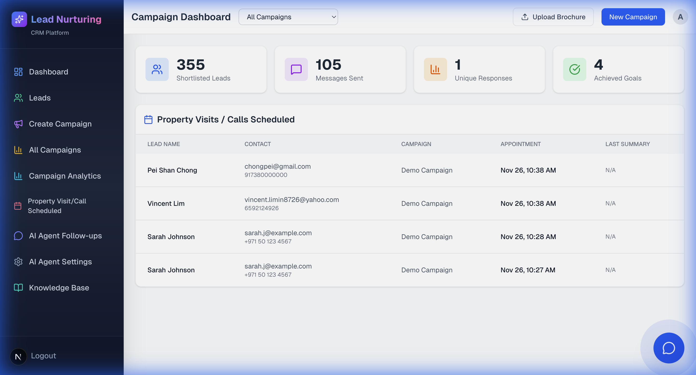
*Main dashboard with navigation and overview*

### Leads Management
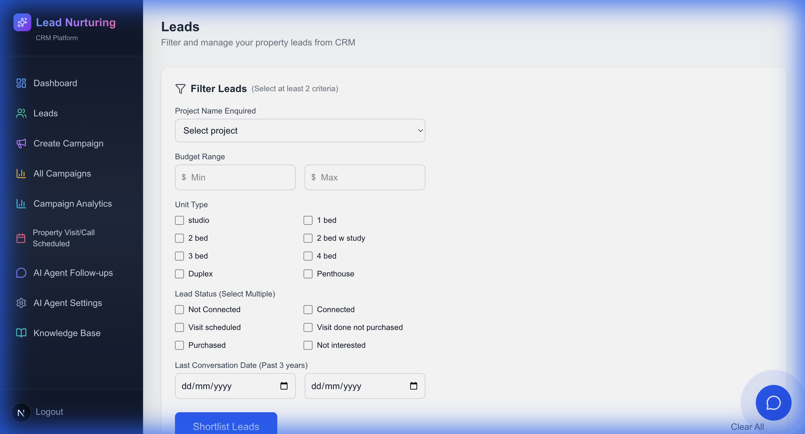
*Browse and filter all lead data from CRM*

### Create Campaign
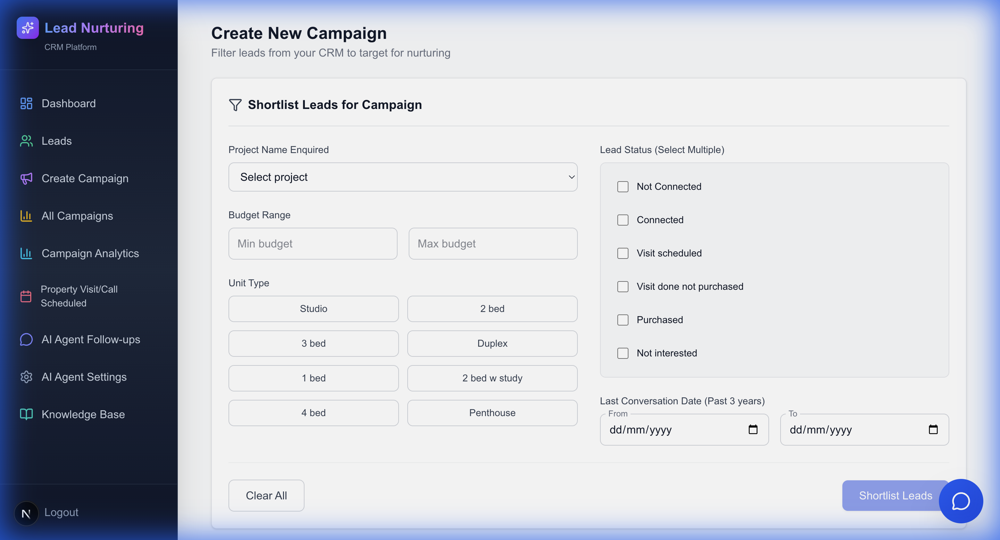
*Shortlist leads and configure campaign settings with real-time lead count*

### Campaign List
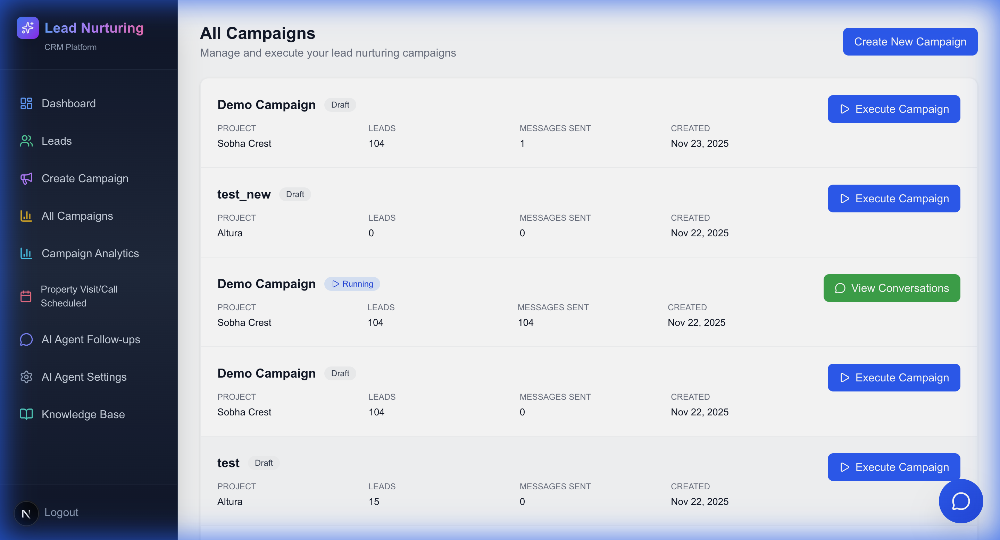
*View all campaigns with status tracking and execution controls*

### Campaign Analytics
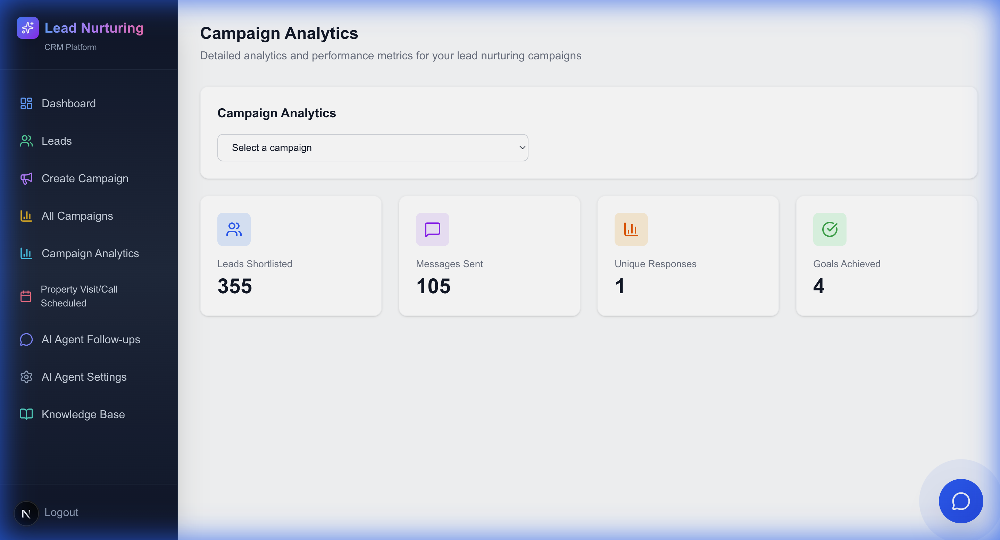
*Comprehensive campaign performance metrics and visualizations*

### AI Agent Follow-ups
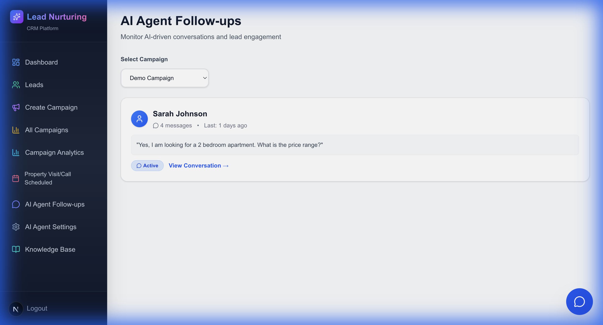
*Track all AI agent conversations with leads*

### Conversation Modal
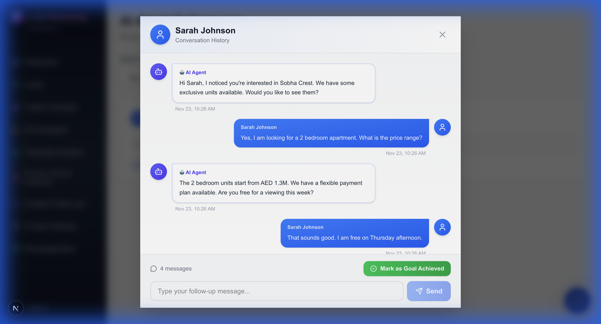
*View full conversation thread and send follow-up messages*

### Scheduled Visits
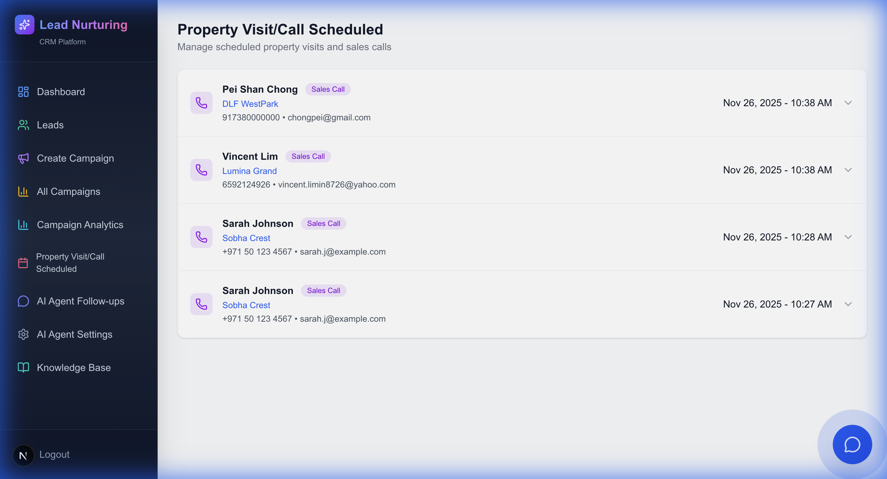
*Track property visits and sales calls scheduled with leads*

### AI Agent Settings
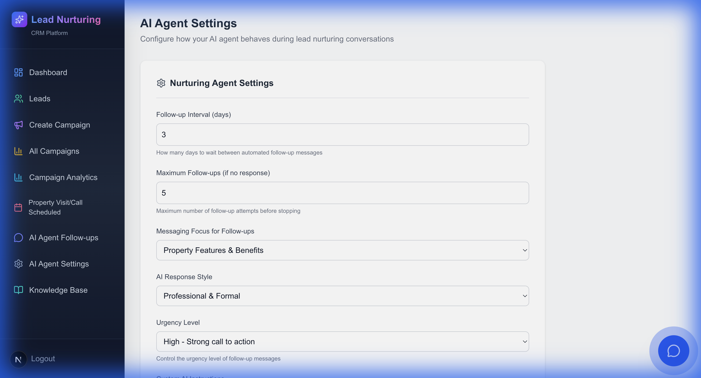
*Configure AI agent behavior, follow-up intervals, and messaging preferences*

### Knowledge Base
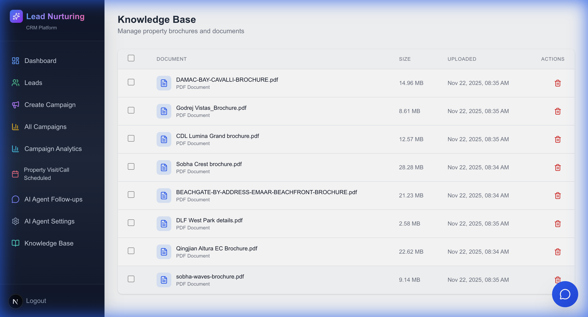
*Upload property documents for AI-powered information retrieval*

---

## 🤖 AI Assistant Deep Dive

The heart of this system is the **AI-Powered Lead Nurturing Agent** that handles intelligent conversations with leads at scale.

### How the AI Assistant Works

#### 1. **Hyper-Personalized Message Generation**

When a campaign is executed, the AI agent generates unique, personalized messages for each lead by analyzing:

- **Lead Demographics**: Name, contact details, family size
- **Past Enquiry Data**: Previously enquired project, budget range, unit preferences
- **Conversation History**: Last conversation summary and context
- **Target Project**: Features and amenities from knowledge base
- **Campaign Offers**: Special promotions and offers

**Example Personalized Message**:
```
Hi Sarah,

I hope this message finds you well. I remember you were interested in 
Sobha Crest last year, particularly looking for a spacious 3-bedroom 
apartment for your family of 4 with a budget around ₹15M.

I wanted to reach out because we have an exciting new project - Lumina Grand - 
that I think would be perfect for you. It offers:

✨ Spacious 3-bedroom units with modern layouts
💼 Excellent investment potential in a prime location
🏊 World-class amenities including swimming pool, gym, and children's play area

📢 Special Launch Offer: 10% discount for early birds!

Would you be interested in scheduling a property viewing?

Best regards,
PropLens AI Team
```


*Example of AI-generated personalized message in conversation thread*

---

#### 2. **Intelligent Response Handling with RAG**

When leads respond with questions, the AI agent uses **Retrieval Augmented Generation (RAG)** to:

1. **Understand Intent**: Analyzes the lead's question using GPT-4
2. **Retrieve Information**: Searches the knowledge base (property brochures) using semantic search
3. **Generate Response**: Creates accurate, contextual answers with relevant property details
4. **Add CTA**: Includes appropriate call-to-action to move lead toward goal

**Example Conversation Flow**:

```
👤 Lead: "What are the amenities and facilities in this property?"

🤖 AI Agent: "Lumina Grand offers exceptional amenities including:

🏊 Temperature-controlled swimming pool
💪 Fully-equipped fitness center with modern equipment
🎮 Children's play area with safe, modern equipment
🌳 Landscaped gardens and walking trails
🚗 Covered parking with EV charging stations
🔒 24/7 security with CCTV surveillance
📶 High-speed fiber internet connectivity

Would you like to schedule a site visit to experience these facilities 
in person? I have availability this week!"
```

**Technology Stack**:
- **Vector Database**: ChromaDB for document embeddings
- **Embeddings**: HuggingFace all-MiniLM-L6-v2
- **LLM**: Google Gemini 1.5 Pro / Anthropic Claude for response generation
- **Framework**: LangChain + LangGraph for multi-agent RAG orchestration

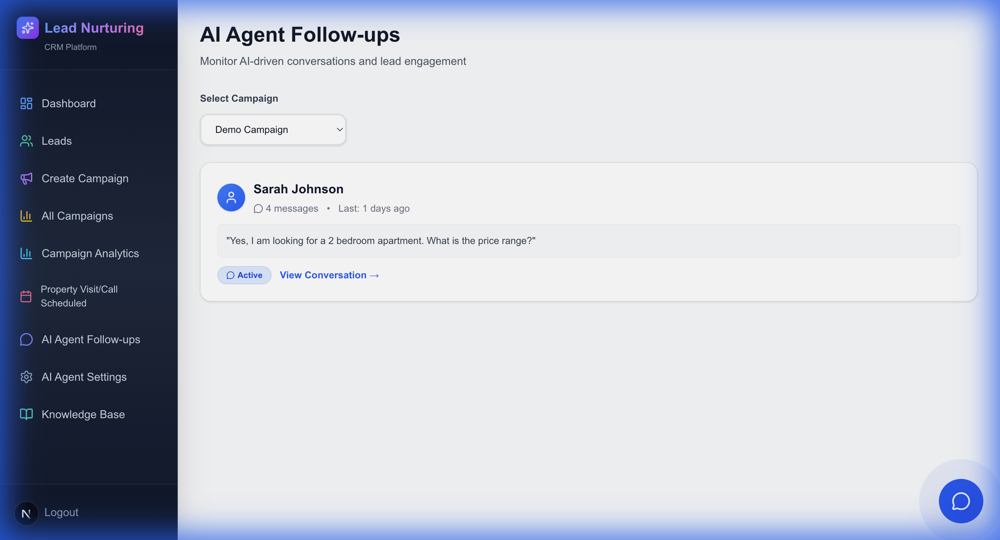
*AI Agent Follow-ups dashboard showing all active conversations*

---

#### 3. **Sentiment Analysis & Prioritization**

The AI automatically analyzes sentiment in lead responses:

- 😊 **Positive**: Lead shows interest, enthusiastic responses
- 😐 **Neutral**: Lead asking questions, gathering information
- 😟 **Negative**: Lead expressing concerns or disinterest

Sentiment helps sales teams prioritize which leads need immediate attention.


*Sentiment badges help prioritize high-intent leads*

---

#### 4. **Goal Detection & Automated Scheduling**

The AI agent detects when a lead expresses intent for:
- 🏢 **Property Visit**: Lead wants to see the property
- ☎️ **Sales Call**: Lead wants to speak with a sales advisor

When detected, the system:
1. ✅ Marks the goal as achieved
2. 📅 Creates a scheduled visit/call record
3. 📧 Notifies the sales team
4. 🎯 Tracks conversion in analytics

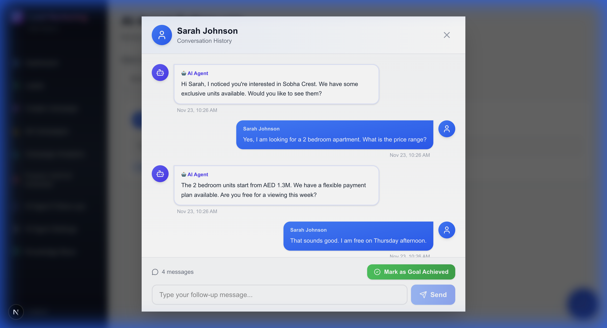
*Mark goals achieved and schedule property visits*

---

#### 5. **Manual Override & Human-in-the-Loop**

Sales associates can:
- 👁️ View all AI conversations in real-time
- ✍️ Send manual follow-up messages when needed
- 🎯 Mark goals as achieved manually
- ⚙️ Configure AI behavior and messaging style

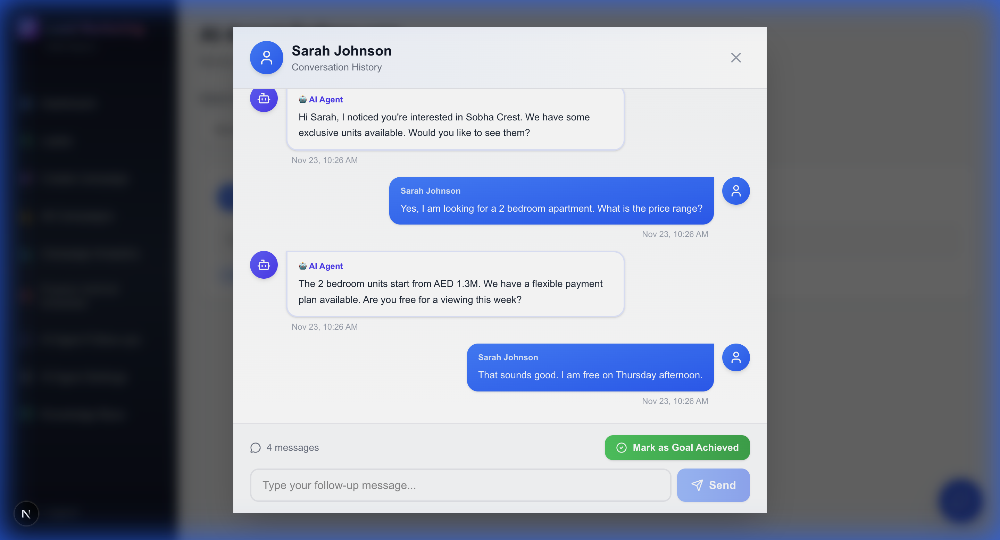
*Manual message override for human-in-the-loop control*

---

#### 6. **Configurable AI Behavior**

The AI agent's personality and approach can be customized:

**Follow-up Settings**:
- Interval between follow-ups (1-30 days)
- Maximum follow-up attempts (1-10)

**Messaging Focus**:
- Property Features & Benefits
- Pricing & Payment Plans
- Location & Amenities
- Investment Opportunities

**Response Style**:
- Professional & Formal
- Friendly & Conversational
- Direct & Concise
- Detailed & Informative

**Urgency Level**:
- Low - Subtle, patient approach
- Medium - Moderate urgency
- High - Strong call to action

**Custom Instructions**:
Free-text field for specific behavioral guidelines


*Comprehensive AI agent configuration options*

---

#### 7. **Campaign Execution at Scale**

The AI can process hundreds of leads simultaneously:

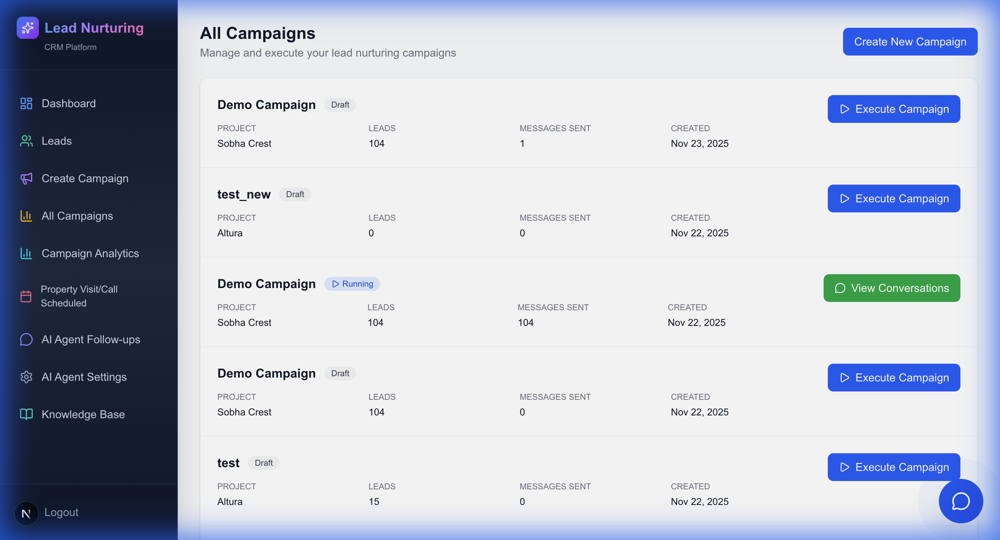
*Execute campaigns with one click to send personalized messages at scale*

**Example Campaign Results**:
- ✅ 104 leads shortlisted
- 📧 104 personalized messages generated
- 💬 45 responses received
- 🎯 12 property visits scheduled
- 📊 11.5% conversion rate

---

### AI Assistant Architecture

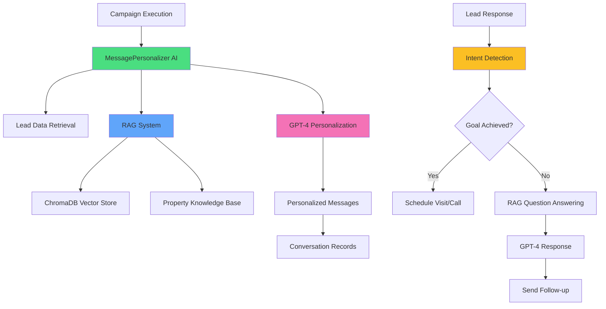

---

### Key AI Features Summary

| Feature | Technology | Benefit |
|---------|-----------|----------|
| **Message Personalization** | Gemini/Claude + Lead Data | 10x more relevant than generic templates |
| **RAG Q&A** | ChromaDB + LangChain | Accurate property information |
| **Sentiment Analysis** | LLM-powered NLP | Prioritize high-intent leads |
| **Goal Detection** | Intent Classification | Automatic conversion tracking |
| **Scalability** | Async Processing | Handle 1000s of leads |
| **Customization** | Configurable Settings | Adapt to brand voice |

---

## ✅ Implemented Features

### Core Functionality (User Stories)

#### ✅ User Story 1: Shortlist Leads for Follow-Up
**Status**: **IMPLEMENTED**

- [x] Filter leads by project name (8 projects available)
- [x] Filter by budget range (min/max custom fields)
- [x] Filter by unit type (multi-select: studio, 1-4 bed, duplex, penthouse)
- [x] Filter by lead status (6 statuses: Not Connected, Connected, Visit Scheduled, etc.)
- [x] Filter by last conversation date (date range picker)
- [x] Real-time lead count display
- [x] Minimum 2 filters requirement enforced
- [x] Flexible filter combinations

**Implementation Details**:
- Frontend: `frontend/app/campaigns/page.tsx`
- Backend: `backend/api/campaign_api.py` - `shortlist_leads` endpoint
- Database queries with Django ORM filters

---

#### ✅ User Story 2: Customize Follow-Up Message
**Status**: **IMPLEMENTED**

- [x] Campaign project name selection (dropdown)
- [x] Message channel selection (Email/WhatsApp)
- [x] Sales offer details (text field)
- [x] Campaign naming
- [x] Auto-save campaign configuration

**Implementation Details**:
- Frontend: `frontend/app/campaigns/page.tsx`
- Backend: `backend/api/models.py` - `CampaignConfig` model
- API: `/api/campaigns/create` endpoint

---

#### ✅ User Story 3: Send Automated Follow-Up Messages
**Status**: **IMPLEMENTED**

- [x] One-click campaign execution
- [x] AI-powered message personalization using:
  - Lead's name and contact details
  - Past project enquiries
  - Budget and unit preferences
  - Last conversation summary
  - Family demographics
- [x] Integration with `MessagePersonalizer` AI agent
- [x] RAG-based property information retrieval
- [x] Automated message dispatch (simulated for POC)
- [x] Conversation record creation
- [x] Campaign status tracking (Draft → Running → Completed)

**Implementation Details**:
- Frontend: `frontend/app/campaigns/list/page.tsx` - Execute button
- Backend: `backend/api/campaign_api.py` - `execute_campaign` endpoint
- AI: `backend/agent/message_personalizer.py`
- RAG: `backend/agent/rag.py` - ChromaDB + OpenAI embeddings

---

#### ✅ User Story 4: Tracking Agent Replies
**Status**: **IMPLEMENTED**

- [x] Dedicated "AI Agent Follow-ups" page
- [x] List all conversations grouped by campaign
- [x] Filter conversations by campaign
- [x] View conversation modal with full thread
- [x] Display AI agent messages and lead responses
- [x] Sentiment analysis for prioritization
- [x] Manual follow-up capability
- [x] Mark goal achieved (visit/call scheduled)
- [x] Auto-create scheduled visit records

**Implementation Details**:
- Frontend: `frontend/app/followups/page.tsx`
- Backend: `backend/api/followup_api.py`
- Models: `Conversation`, `SentMessage`, `ScheduledVisit`

---

### Additional Features Implemented

#### ✅ Campaign Analytics Dashboard
- Campaign-wise metrics visualization
- Key performance indicators:
  - Leads shortlisted
  - Messages sent
  - Responses received
  - Goals achieved
- Charts and trend analysis
- Campaign comparison

#### ✅ Knowledge Base Management
- Document upload interface (PDF, DOCX, TXT)
- AI-powered document processing
- Vector database (ChromaDB) for semantic search
- Property-specific information retrieval
- RAG integration for intelligent responses

#### ✅ AI Agent Configuration
- Follow-up interval settings (days)
- Maximum follow-up attempts
- Messaging focus selection:
  - Property Features & Benefits
  - Pricing & Payment Plans
  - Location & Amenities
  - Investment Opportunities
- AI response style:
  - Professional & Formal
  - Friendly & Conversational
  - Direct & Concise
  - Detailed & Informative
- Urgency level control (Low/Medium/High)
- Custom AI instructions textarea

#### ✅ Scheduled Visits Dashboard
- List all property visits and sales calls
- Lead contact information
- Visit dates and times
- Conversation summaries
- Goal tracking

#### ✅ Premium UI/UX
- Modern dark gradient sidebar navigation
- Colorful icon system for easy navigation
- Smooth hover animations
- Responsive design
- Professional branding with gradient text
- Consistent design language across all pages

---

## 🔮 Future Improvements

Based on the requirements document and current implementation, here are recommended improvements:

### High Priority

#### 1. **Real Message Integration**
**Current**: Messages are logged to console (POC simulation)  
**Improvement**: 
- Integrate with SendGrid/AWS SES for email delivery
- Integrate with Twilio/WhatsApp Business API for WhatsApp messages
- Real message delivery with tracking
- Webhooks for response handling

#### 2. **Automated Follow-up Scheduler**
**Current**: Manual follow-up triggering  
**Improvement**:
- Implement Celery task queue
- Redis for message broker
- Automated follow-up generation based on:
  - Follow-up interval settings
  - Lead response status
  - Campaign rules
- Scheduled task execution
- Retry logic for failed messages

#### 3. **Email/WhatsApp Response Parsing**
**Current**: Manual response simulation  
**Improvement**:
- Email webhook integration (SendGrid, Mailgun)
- WhatsApp webhook for incoming messages
- Automatic conversation threading
- Intent detection for goal identification
- Auto-trigger visit scheduling

#### 4. **Advanced Analytics**
**Current**: Basic campaign metrics  
**Improvement**:
- Conversion funnel visualization
- Time-series analysis
- A/B testing for message templates
- Lead scoring and prediction
- ROI tracking
- Export reports (PDF, CSV)

#### 5. **Multi-tenancy Support**
**Current**: Single organization  
**Improvement**:
- Organization/team management
- Role-based access control (RBAC)
- Sales associate assignment
- Team performance tracking
- Data isolation per organization

### Medium Priority

#### 6. **Message Template Library**
- Pre-built message templates by category
- Template versioning
- A/B testing capabilities
- Success rate tracking per template
- Template customization per campaign

#### 7. **Lead Scoring System**
- ML-based lead scoring
- Engagement score calculation
- Prioritization in follow-ups
- Predictive analytics for conversion likelihood
- Automatic cold/warm/hot lead classification

#### 8. **Conversation Intelligence**
- Automatic conversation summarization
- Key information extraction
- Objection detection
- Buying signals identification
- Follow-up recommendation AI

#### 9. **Integration Hub**
- CRM integrations (Salesforce, HubSpot, Zoho)
- Calendar integrations (Google Calendar, Outlook)
- Document storage (Dropbox, Google Drive)
- Video conferencing (Zoom, Google Meet)
- Payment gateways for booking deposits

#### 10. **Mobile Application**
- React Native mobile app
- Push notifications for lead responses
- On-the-go campaign management
- Voice-to-text for quick replies
- Offline mode support

### Low Priority

#### 11. **Advanced Personalization**
- Dynamic content blocks
- Conditional messaging logic
- Multi-language support
- Cultural sensitivity adjustments
- Timezone-aware scheduling

#### 12. **Compliance & Security**
- GDPR compliance features
- Data retention policies
- Audit logging
- Encryption at rest and in transit
- Two-factor authentication

#### 13. **Performance Optimization**
- Database query optimization
- Caching layer (Redis)
- CDN for static assets
- Lazy loading and pagination
- Background job processing

---

## 📁 Project Structure

```
cms_real_estate/
├── backend/
│   ├── api/                    # Django app
│   │   ├── models.py          # Database models
│   │   ├── campaign_api.py    # Campaign endpoints
│   │   ├── followup_api.py    # Follow-up endpoints
│   │   ├── knowledge_api.py   # Knowledge base endpoints
│   │   └── ...
│   ├── agent/                  # AI agents
│   │   ├── message_personalizer.py
│   │   ├── rag.py             # RAG system
│   │   └── ...
│   ├── config/                 # Django settings
│   ├── data/                   # Sample data files
│   ├── chroma_db/              # Vector database
│   ├── manage.py
│   └── requirements.txt
├── frontend/
│   ├── app/                    # Next.js pages
│   │   ├── page.tsx           # Dashboard
│   │   ├── leads/             # Leads page
│   │   ├── campaigns/         # Campaign pages
│   │   ├── analytics/         # Analytics
│   │   ├── followups/         # Follow-ups
│   │   ├── settings/          # AI settings
│   │   ├── scheduled/         # Scheduled visits
│   │   └── knowledge/         # Knowledge base
│   ├── components/
│   │   └── Sidebar.tsx        # Navigation
│   ├── public/
│   ├── package.json
│   └── tsconfig.json
├── demo/                       # Reference screenshots
├── intelligent_frames/         # UI mockups
├── workflow_frames/            # Workflow diagrams
└── README.md                   # This file
```

---

## 📚 API Documentation

### Base URL
```
http://localhost:8000/api
```

### Endpoints

#### Campaigns

**Create Campaign**
```http
POST /campaigns/create
Content-Type: application/json

{
  "name": "Q4 Luxury Campaign",
  "target_project": "Sobha Crest",
  "channel": "email",
  "budget_min": 1000000,
  "budget_max": 2000000,
  "unit_types": ["2 bed", "3 bed"],
  "lead_status": "Connected"
}
```

**Shortlist Leads**
```http
POST /campaigns/shortlist
Content-Type: application/json

{
  "target_project": "Sobha Crest",
  "budget_min": 1000000,
  "budget_max": 2000000,
  "unit_types": ["2 bed"],
  "lead_status": "Connected"
}

Response:
{
  "count": 104
}
```

**Execute Campaign**
```http
POST /campaigns/{campaign_id}/execute

Response:
{
  "status": "success",
  "message": "Campaign executed successfully. Sent 104 messages to 104 leads.",
  "messages_sent": 104,
  "leads_reached": 104
}
```

**List Campaigns**
```http
GET /campaigns/list

Response:
{
  "campaigns": [
    {
      "id": 1,
      "name": "Q4 Luxury Campaign",
      "target_project": "Sobha Crest",
      "channel": "email",
      "status": "running",
      "messages_sent": 104,
      "leads_count": 104,
      "created_at": "2025-11-23T10:30:00Z",
      "executed_at": "2025-11-23T10:35:00Z"
    }
  ]
}
```

#### Follow-ups

**Get Conversations**
```http
GET /followups/conversations?campaign_id=1

Response:
{
  "conversations": [
    {
      "lead_id": 1,
      "lead_name": "John Doe",
      "sentiment": "positive",
      "last_message": "What are the amenities?",
      "last_message_time": "2025-11-23T11:00:00Z"
    }
  ]
}
```

**Send Follow-up Message**
```http
POST /followups/send
Content-Type: application/json

{
  "lead_id": 1,
  "message": "Looking forward to our meeting!"
}
```

**Mark Goal Achieved**
```http
POST /followups/mark-goal
Content-Type: application/json

{
  "lead_id": 1,
  "visit_date": "2025-11-25",
  "visit_time": "15:00"
}
```

#### Knowledge Base

**Upload Document**
```http
POST /knowledge/upload
Content-Type: multipart/form-data

file: <PDF/DOCX/TXT file>
project_name: "Sobha Crest"
```

**List Documents**
```http
GET /knowledge/documents

Response:
{
  "documents": [
    {
      "id": 1,
      "filename": "sobha_crest_brochure.pdf",
      "project_name": "Sobha Crest",
      "upload_date": "2025-11-23T09:00:00Z"
    }
  ]
}
```

#### AI Agent Settings

**Get Settings**
```http
GET /agent-settings

Response:
{
  "followup_interval_days": 3,
  "max_followups": 5,
  "messaging_focus": "Property Features & Benefits",
  "response_style": "Professional & Formal",
  "urgency_level": "Medium - Moderate urgency",
  "custom_instructions": "Always mention property views"
}
```

**Update Settings**
```http
POST /agent-settings
Content-Type: application/json

{
  "followup_interval_days": 5,
  "max_followups": 7,
  "messaging_focus": "Pricing & Payment Plans",
  "response_style": "Friendly & Conversational",
  "urgency_level": "High - Strong call to action",
  "custom_instructions": "Focus on investment potential"
}
```

---

## 🤝 Contributing

Contributions are welcome! Please follow these steps:

1. Fork the repository
2. Create a feature branch (`git checkout -b feature/AmazingFeature`)
3. Commit your changes (`git commit -m 'Add some AmazingFeature'`)
4. Push to the branch (`git push origin feature/AmazingFeature`)
5. Open a Pull Request

---

## 📄 License

This project is licensed under the MIT License - see the LICENSE file for details.

---

## 🙏 Acknowledgments

- Google Gemini AI and Anthropic Claude for LLM APIs
- LangChain and LangGraph for multi-agent framework
- Astral (uv) for ultra-fast Python package management
- Next.js and Django communities
- ChromaDB for vector database
- All contributors and testers

---

## 📧 Support

For questions or support, please open an issue on GitHub or contact the development team.

---

**Built with ❤️ for Real Estate Sales Teams**
